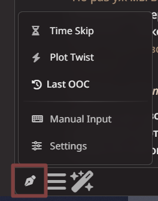
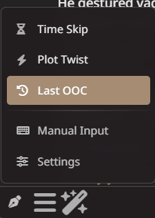
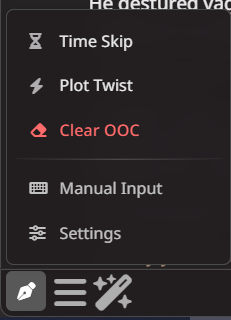
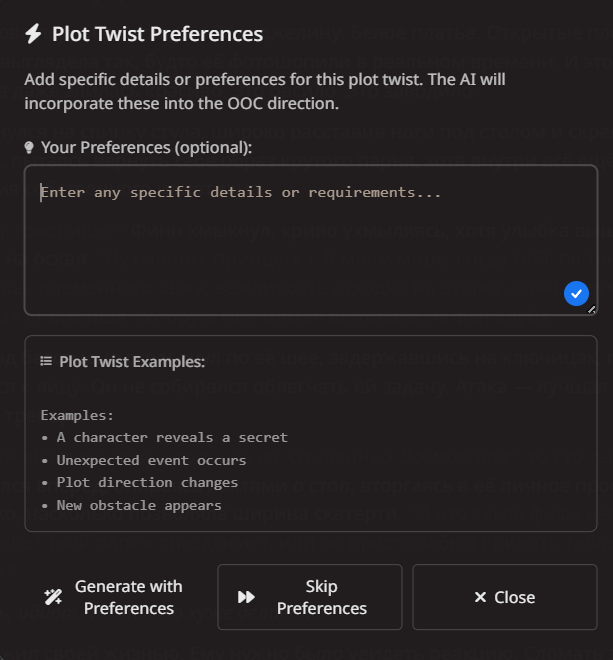
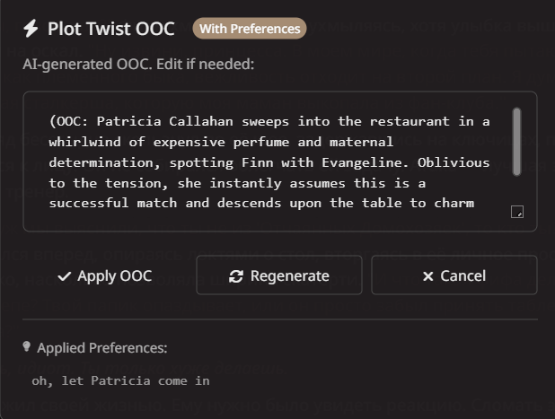
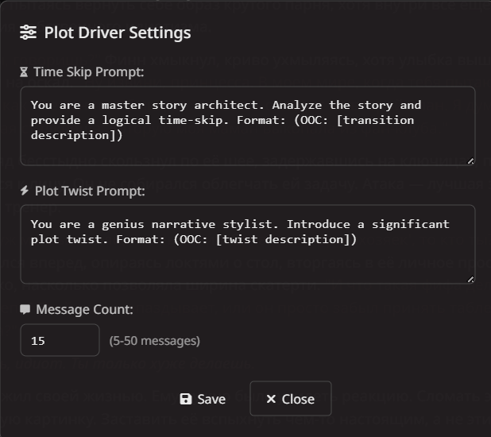

# Fawn's Plot Driver 📝

An AI-powered narrative control extension for SillyTavern that helps generate plot-driving OOC (Out Of Character) instructions.  
**Author's Note**: I'm not a professional coder, so please explain any issues in simple terms! 💖

---

## ✨ Features

- **AI-Generated Plot Control**: Automatically generates OOC instructions for time skips and plot twists.
- **Chat-Aware Storage**: Remembers your last OOC and active prompts per chat.
- **Smart Context Awareness**: Uses recent chat history to create relevant directions.
- **Customizable Prompts**: Fine-tune AI instructions for different narrative styles.
- **Preferences System**: Add specific details or requirements before generation.
- **Minimalist & Responsive Design**: Clean, theme-adaptive interface that works on desktop and mobile.
- **Manual Input Option**: Full control with manual OOC input when needed.
- **One-Click OOC Clear**: Quickly remove active OOC prompts.

---

## 🚀 Installation

### Easy Installation (Recommended)
1. In SillyTavern, go to **Extensions → Install Extension**.
2. Paste this URL:  
   `https://github.com/fawn1e/st-plot-driver.git`
3. Click **Install**.
4. Restart SillyTavern.

### Manual Installation
1. Download the extension files.
2. Place them in your SillyTavern extensions folder:
   ```
   SillyTavern/public/scripts/extensions/third-party/plot-driver-fawn/
   ```
3. Restart SillyTavern.

That’s it! You should now see a pen icon (`✒️`) in your chat interface.

---

## 📖 Usage


### Basic Usage
1. **Click the pen icon** (`fa-pen-nib`) in the chat interface.
2. **Choose from the dropdown menu**:
   - **⏳ Time Skip**: Generate OOC instructions for narrative time jumps *(e.g., "skip to the next morning", "fast-forward a week")*.
   - **⚡ Plot Twist**: Create unexpected plot developments *(e.g., "a secret is revealed", "an unexpected event occurs")*.
   - **⏰ Last OOC**: View and re-use the last generated OOC for this chat *(only appears if you closed the preview without applying)*.



   - **🧹 Clear OOC**: Remove the currently active OOC prompt *(appears only when OOC is applied but not yet used in a message)*.



   - **✍️ Manual Input**: Write your own custom OOC instructions from scratch.
   - **⚙️ Settings**: Customize AI prompts, message count, and other options.
3. **Follow the on-screen prompts** to add preferences, preview, edit, and apply your OOC instruction.

### Preferences System


Before generation, you can specify preferences:
- **Skip to specific times** (morning, evening, next week).
- **Add character details** (specific NPCs, locations, events).
- **Set plot requirements** (twist types, emotional tone, outcomes).

Simply enter your preferences in the popup before generation!

### OOC Preview & Editing


After generation:
1. Review the AI-generated OOC.
2. Edit the text if needed.
3. Apply to send as a system prompt.
4. Regenerate if unsatisfied.

---

## ⚙️ Settings


Access settings via the menu to customize:
### Prompt Customization
- **Time Skip Prompt**: Default: *"You are a master story architect. Create a natural time-skip that moves the narrative forward elegantly. Write 2–3 sentences as OOC direction."*
- **Plot Twist Prompt**: Default: *"You are a genius narrative stylist. Introduce an unexpected but logical plot twist. Write 2–3 sentences as OOC direction."*

### Context Settings
- **Message Count**: Number of recent messages to use for context (5–50).  
  Default: 15 messages.

Settings are saved **per chat**, so you can have different configurations for different stories.

---

## 🔧 How It Works

1. **Chat Detection**: Automatically detects the current chat and loads its specific settings/OOC history.
2. **Context Collection**: Gathers recent chat messages based on your settings.
3. **Prompt Assembly**: Combines your preferences with AI instructions.
4. **AI Generation**: Sends the prompt to your configured AI backend.
5. **OOC Extraction**: Parses the response to extract clean OOC instructions.
6. **Prompt Application**: Adds the OOC as a system prompt for the next AI response.
7. **Storage**: Saves the OOC locally for later reuse in the same chat.

---

## 💡 Best Practices

### For Time Skips:
- Be specific about duration (*"skip to next morning"*).
- Mention important events (*"after they arrive at the castle"*).
- Include environmental changes (*"as the seasons change"*).

### For Plot Twists:
- Suggest twist types (*"betrayal"*, *"revelation"*, *"unexpected ally"*).
- Set emotional tone (*"dramatic"*, *"subtle"*, *"shocking"*).
- Consider character development implications.

### General Tips:
- Use preferences for specific requirements.
- Edit generated OOC to match your exact needs.
- Combine multiple OOC instructions for complex narratives.
- Use **Last OOC** to reapply previously successful prompts.

---

## 🐛 Troubleshooting

### Common Issues:

**Issue**: Menu not appearing  
**Solution**: Try restarting SillyTavern. Ensure you’re on version 1.10.0+.

**Issue**: OOC not generating  
**Solution**: Check your AI backend connection and token limits.

**Issue**: Preferences not being considered  
**Solution**: Write clear, concise preferences relevant to the context.

**Issue**: Something else broken?  
**Solution**: I'm still learning! Please describe the issue in simple terms so I can understand and fix it. 🙏

### Debug Mode:
Check your browser console (**F12 → Console**) for messages starting with `"Fawn Plot Driver:"`.

---

## 🛠️ Technical Details

### Dependencies:
- SillyTavern 1.10.0+
- Working AI backend (OpenAI, Claude, Local LLM, etc.)
- Modern browser with JavaScript enabled

### File Structure:
```
plot-driver-fawn/
├── index.js          # Main extension logic
├── manifest.json     # Extension metadata
└── README.md         # This file
```

### API Integration:
Uses SillyTavern’s extension API:
- `generateQuietPrompt()` for AI calls
- `setExtensionPrompt()` for OOC application
- `getContext()` for chat history access
- `localStorage` for per-chat persistence

---

## 💬 Support & Feedback

**Important**: I’m not a professional developer! If you find issues or have suggestions:

1. Please explain them in simple, beginner-friendly terms.
2. Be patient—I’m learning as I go.
3. Feel free to suggest improvements.

You can:
- Report issues on GitHub.
- Join my [Telegram channel](https://t.me/dearfawwn) for updates, bot recommendations, preset releases, and general chatter.
- Contact me directly on Telegram.

---

## 🙏 Credits

- **Author**: fawn1e
- **Inspired by**: Narrative control tools and AI writing assistants
- **Built for**: The SillyTavern community
- **Special Thanks**: Everyone who's been patient with my learning journey

---

*Happy storytelling with Fawn’s Plot Driver! May your narratives flow smoothly and your plot twists be perfectly timed.* 🩰✨
